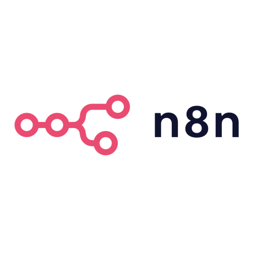

# N8N Tutorial - Day 1

## Pengenalan N8N untuk Automation

---

<!-- SECTION 1: Introduction -->
# Introduction N8N

---

## Apa itu N8N?


<!-- Placeholder: Logo N8N -->

- **N8N** adalah tool untuk otomatisasi pekerjaan bisnis Anda
- Menghubungkan 300+ aplikasi favorit Anda tanpa perlu coding
- Seperti main puzzle - drag & drop aja!
- Bisa dijalankan sendiri, data tetap aman di tangan Anda

Note:
Bayangkan tidak perlu lagi copy-paste data manual, atau mengecek email satu-satu. N8N bisa bantu otomatisasi semua itu!

---

## Target Hari Ini

Setelah sesi ini, peserta dapat:

- ✅ Mengenal cara kerja N8N untuk bisnis
- ✅ Membuat otomatisasi pertama Anda
- ✅ Menggunakan berbagai cara memulai otomatisasi
- ✅ Mengelola koneksi ke aplikasi favorit
- ✅ Memantau dan mengecek hasil otomatisasi

---

<!-- SECTION 2: Demo Workflow -->
# Demo: Workflow Pertama Anda

---

## Demo: Otomatisasi Customer Inquiry

### Skenario Bisnis:
**Customer Bertanya** → **Respon Otomatis** → **Simpan Lead** → **Notifikasi Tim**

*Seperti punya asisten virtual 24/7 untuk bisnis Anda*

---

## Live Demo: Dari Pertanyaan ke Penjualan

### Yang Terjadi Otomatis:
1. **Customer isi form kontak** di website Anda
2. **Email welcome** langsung terkirim ke customer
3. **Data tersimpan** di Google Sheets untuk follow-up
4. **Tim sales dapat notifikasi** di Slack ada lead baru

---

<!-- SECTION 3: Workflow Concepts -->
# Memahami Konsep Workflow dan Node

---

## Apa itu Workflow?

**Workflow** = Seperti SOP bisnis, tapi dijalankan otomatis oleh komputer. Input yang kita masukkan akan diproses, dan dapat menghasilkan output.

### Contoh Sederhana: Proses Order Kopi Online
1. **Input**: Customer pesan kopi via WhatsApp
2. **Proses**: Catat pesanan → Cek stok → Hitung total
3. **Output**: Konfirmasi ke customer + notifikasi ke barista

---

## Anatomik Node

### Komponen Node:
- **Input Connection** - Menerima data
- **Node Icon & Name** - Identifikasi node
- **Output Connection** - Mengirim data
- **Status Indicator** - Status eksekusi
---

## Cara Kerja Antar Node

### Contoh Nyata:
1. **Google Sheets** (ambil data customer baru)
2. **Gmail** (terima data nama & email, kirim welcome email)
3. **Slack** (terima data dari Gmail, kirim notifikasi ke tim)

**Setiap node = Seperti orang di assembly line. Terima hasil kerja sebelumnya, lakukan tugasnya, teruskan ke yang berikutnya.**

---

## Menggunakan Data dari Node Sebelumnya

### Contoh Praktis:
- **Google Sheets** punya field: `nama`, `email`, `perusahaan`
- **Gmail node** butuh email → Drag `email` dari Sheets
- **Slack node** butuh nama → Drag `nama` dari Sheets

---

<!-- SECTION 4: Triggers -->
# Memahami Berbagai Trigger pada N8N

---

## Google Sheets Trigger

- **Otomatis jalan** saat ada baris baru di spreadsheet
- Monitor perubahan data secara real-time
- Langsung proses data yang baru masuk
- Cocok untuk input data tim

```
Use case: Tim sales input lead baru di Google Sheets, langsung kirim welcome email dan masuk ke CRM
```

---

## Telegram Trigger

- **Otomatis jalan** saat ada pesan baru di grup/channel
- Monitor chat grup atau channel tertentu
- Langsung respon pesan masuk

```
Use case: Customer service terima komplain di grup Telegram, langsung buat ticket dan notify manager
```

---

## Google Calendar Trigger

- **Otomatis jalan** saat ada event baru atau dimulai
- Monitor calendar pribadi atau tim

```
Use case: Saat meeting dicancel, kabari seluruh peserta meeting
```

---

<!-- SECTION 5: Credentials -->
# Menghubungkan Aplikasi Favorit Anda

---

## Mengelola Kredensial dengan Aman

**Kredensial** = "Kunci akses" untuk menghubungkan N8N dengan aplikasi Anda

---

## Cara Menghubungkan Aplikasi

### Langkah Mudah:
1. Pilih **aplikasi** yang mau dihubungkan
2. Klik **"Login & Connect"**
3. Masukkan **username/password** seperti biasa
4. **Izinkan akses** untuk N8N
5. **Selesai!** Aplikasi sudah terhubung

---

<!-- SECTION 6: Execution History -->
# Melihat Riwayat Eksekusi

---

## Execution History Overview

**Execution History** = Sejarah dari semua workflow yang pernah dijalankan

- **Status** eksekusi (Success/Failed/Running)
- **Timestamp** kapan dijalankan
- **Duration** berapa lama eksekusi
- **Data** yang diproses

---

## Waktunya Praktik! 🚀

### Sekarang Giliran Anda!
Setelah memahami konsep dasar N8N, saatnya **hands-on experience**:

- 💼 **Build automation nyata** untuk bisnis Anda
- 🔗 **Connect aplikasi favorit** yang sudah Anda pakai
- ⚡ **Rasakan langsung** efisiensi automation
- 🎯 **Lihat hasil** dalam hitungan menit

**Tips**: Jangan takut eksperimen - N8N aman untuk dicoba!

Note:
Pastikan semua peserta siap dengan laptop dan akses internet. Berikan motivasi bahwa mereka akan membuat sesuatu yang berguna untuk pekerjaan mereka.

---

## Apa itu Pinned Data?

**Pinned Data** = Data sample yang "disematkan" ke node untuk testing

### Mengapa Penting?
- 🧪 **Test workflow** tanpa trigger real
- 🔍 **Debug masalah** dengan data yang sama
- ⚡ **Kembangkan lebih cepat** tanpa tunggu data asli
- 📝 **Dokumentasi** - contoh data untuk tim lain

---

## Contoh Real: Pin Data dari Order E-commerce

### Skenario Bisnis:
Customer order produk di online shop → **Auto kirim konfirmasi WhatsApp + Email + Notifikasi tim**

### Masalah Tanpa Pinned Data:
❌ Test message template = Buat fake order di sistem

❌ Debug format pesan = Ganggu database live

❌ Demo ke stakeholder = Kirim spam ke customer real

---

### Solusi dengan Pinned Data:

✅ **Ambil data order real** yang sudah sukses diproses

✅ **Pin order data** (nama, produk, harga, alamat)

✅ **Test message template** berkali-kali dengan data sama

✅ **Perfect messaging** tanpa ganggu customer!

### Contoh Workflow:
1. **Shopee/Tokopedia** (order masuk) → 2. **Pin data order** → 3. **WhatsApp** (test template) → 4. **Email + Slack** (test messaging)

---

## Membuat Pinned Data dari Past Execution

### Langkah Mudah:
1. **Buka Execution History** - Pilih eksekusi yang berhasil
2. **Klik node** yang datanya mau di-pin
3. **Klik "Pin Data"** - Button di panel samping
4. **Konfirmasi** - Data otomatis tersimpan sebagai sample
---

<!-- SECTION 7: Hands-on Exercise -->
# Latihan: Buat Automation Pertama Anda

---

## Exercise: Automation Newsletter Signup

### Target Automation:
**Customer Daftar Newsletter** → **Kirim Welcome Email** → **Simpan ke Database** → **Notifikasi Tim**

### Business Value:
Otomatisasi proses newsletter signup tanpa perlu copy-paste manual

---

## Selamat! Anda Sudah Jadi Automation Expert! 🎉

### Anda telah berhasil:

✅ Mengotomatisasi proses bisnis

✅ Menghemat waktu tim dengan automation

✅ Menghubungkan beberapa aplikasi sekaligus

✅ Membuat sistem yang bekerja 24/7 untuk bisnis Anda

**Bayangkan berapa jam per minggu yang bisa dihemat dengan automation ini!**
